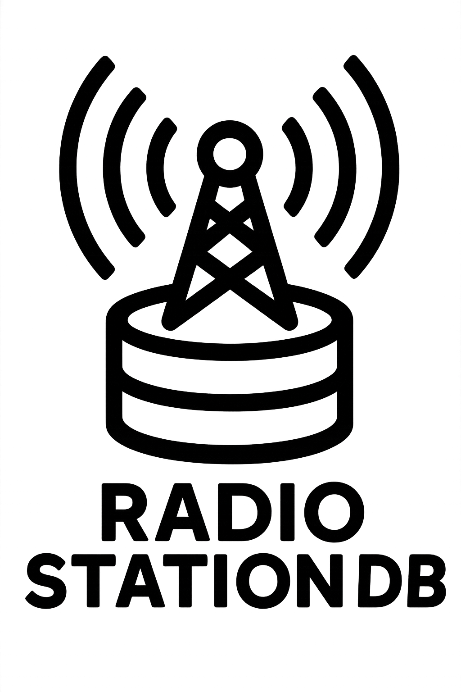

<div align="center">
  
</div>

# Radio Station Database

A comprehensive Python application that creates a SQLite database of radio stations with FCC data, LLM-discovered genre classifications, and preprocessed signal propagation data.

## Features

- **FCC Data Integration**: Fetches complete FM/AM radio station data from official FCC sources
- **Signal Propagation Data**: Preprocesses station location, power, and terrain data to enable downstream GPS-based signal strength estimation
- **LLM Genre Discovery**: Uses powerful LLMs (Gemini 2.5 Pro/Claude Opus 4) to discover station genres from web sources
- **Deduplication**: Handles duplicate stations across multiple data sources
- **SQLite Database**: Optimized for mobile app consumption with proper indexing
- **Professional CLI**: Rich-formatted command-line interface with Typer
- **GitHub Pages Deployment**: Compressed database hosting for free distribution

## Installation

This project uses [rye](https://github.com/astral-sh/rye) for package management.

```bash
# Install rye if you haven't already
curl -sSf https://rye.astral.sh/get | bash

# Clone and setup
git clone <repository-url>
cd radio-station-db
rye sync
```

## Usage

### Initialize Database
```bash
rye run radio-db init
```

### Fetch FCC Data
```bash
# Fetch all stations (FM + AM)
rye run radio-db fetch --service both

# Fetch only FM stations
rye run radio-db fetch --service fm

# Fetch only AM stations  
rye run radio-db fetch --service am
```

### View Statistics
```bash
rye run radio-db stats
```

### Search Stations
```bash
# Search by call sign
rye run radio-db search "KQED"

# Search by city
rye run radio-db search "Austin" --limit 5
```

## Data Sources

- **FM Stations**: https://transition.fcc.gov/fcc-bin/fmq (88.1-107.9 MHz)
- **AM Stations**: https://transition.fcc.gov/fcc-bin/amq (530-1700 kHz)

## Database Schema

The SQLite database contains:

### `stations` table
- Station identification (call sign, facility ID)
- Technical specifications (frequency, power, coordinates)
- Geographic information (city, state, lat/lon)
- Metadata (status, data source, timestamps)

## Data Statistics

<!-- TODO: Populate with real database statistics using GitHub Actions -->
Current database contains: _Statistics will be auto-generated here_

## Development

### Project Structure
```
src/
├── __init__.py          # Package initialization
├── cli.py              # Typer CLI interface
├── database.py         # SQLite database operations
├── fcc_parser.py       # FCC data parsing with Pydantic
└── schema.sql          # Database schema definition
```

### Field Mappings
The parser uses labeled field access instead of magic numbers for maintainability:
```python
FM_FIELDS = {
    'call_sign': 1,
    'frequency': 2,
    'city': 10,
    'state': 11,
    # ... coordinate mappings
}
```

### Development Scripts

```bash
# Update third-party license notices
rye run update-licenses
```

## Future Features

- [ ] Signal propagation preprocessing with terrain data for downstream GPS-based calculations
- [ ] LLM-based genre discovery from Wikipedia, station websites, and web sources
- [ ] Advanced deduplication algorithms
- [ ] Compressed database deployment via GitHub Pages
- [ ] Mobile app integration APIs

## License

This project is licensed under the MIT License.
